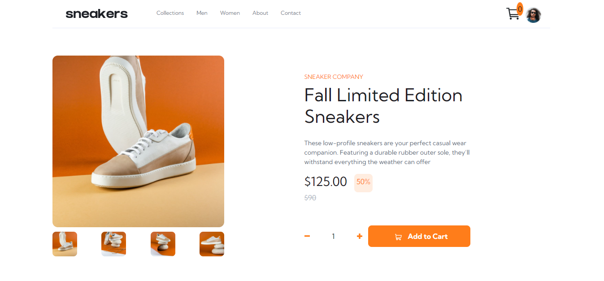

# Frontend Mentor E-commerce-product-page Challenge
This is a solution to the [E-commerce product page challenge on Frontend Mentor](https://www.frontendmentor.io/challenges/ecommerce-product-page-UPsZ9MJp6). Frontend Mentor challenges help you improve your coding skills by building realistic projects.

### The challenge

Users should be able to: 

- View the optimal layout for the site depending on their device's screen size  
- See hover states for all interactive elements on the page  
- Open a lightbox gallery by clicking on the large product image  
- Switch the large product image by clicking on the small thumbnail images  
- Add items to the cart  
- View the cart and remove items from it  

# Built with
-HTML  
-CSS  
-Javascript

## Demo
[Link](https://adham909.github.io/E-commerce-product-page-/)
